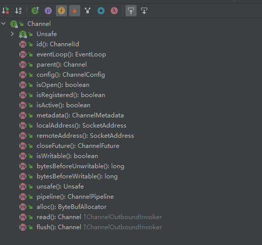
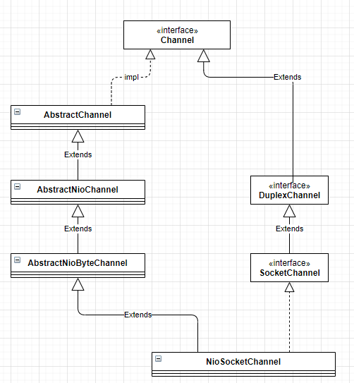
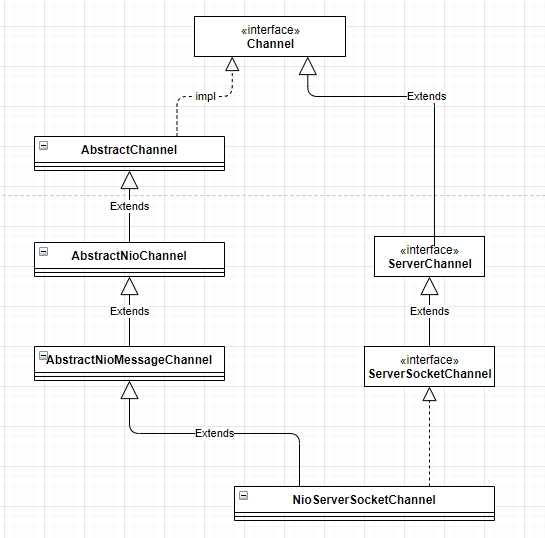

Channel是JDK NIO类库中的一个重要组成，可以理解为数据的通道，提供**端口绑定、socket连接、数据读写**等功能。

类似的在Netty中，也提供了自己的Channel及其子类实现，用于**异步IO和其他相关操作**。

# 主要方法



- **Channel read()**：从当前Channel中
- **Channel flush()**：将之前写入的数据全部写入到目标Channel中，发送给通信对方。
- **ChannelConfig config()**：获取当前Channel的配置信息，例如 `CONNECT_TIMEOUT_MILLIS`
- **boolean isOpen()**：判断当前Channel是否已经打开
- **boolean isRegistered()**：判断当前`Channel`是否已经注册到`EventLoop`上
- **boolean isActive()**：判断当前`Channel`是否已经处于激活状态
- **ChannelMetadata metadata()**：获取当前`Channel `的元数据描述信息，包括 TCP 参数配置等。当创建Socket的时候需要制定TCP参数（例如接收和发送的TCP缓冲区大小、TCP的超时时间等）。在 Netty 中，每个 Channel 对应一个物理连接，每个连接都有自己的 TCP 参数配置。所以，Channel 会聚合一个ChannelMetadata 用来对 TCP 参数提供元数据描述信息，通过 metadata()方法就可以获取当前 Channel 的 TCP 参数配置。
- **SocketAddress localAddress()**：获取当前 Channel 的本地绑定地址
- **SocketAddress remoteAddress()**：获取当前 Channel 通信的远程 Socket 地址
- **EventLoop eventLoop()**：一个`EventLoop`对应多个`Channel`，`Channel`需要注册到`EventLoop`的多路复用器上，用于处理IO事件。通过`eventLoop()`方法可以获取到`Channel`注册的`EventLoop`
- **Channel parent()**：对于服务端 Channel 而言，它的父 Channel 为空;对于客户端 Channel，它的父 Channel 就是创建它的 ServerSocketChannel
- **ChannelId id()**：它返回 Channelld 对象，Channelld 是 Channel 的唯一标识。

# Channel实现类

## NioSocketChannel



`NioSocketChannel`用于提供**Socket连接、数据读写**等功能，实际的数据读写操作都发生在`NioSocketChannel`中。

### doConnect

```java
public class NioSocketChannel extends AbstractNioByteChannel implements io.netty.channel.socket.SocketChannel {

    @Override
    protected boolean doConnect(SocketAddress remoteAddress, SocketAddress localAddress) throws Exception {
        if (localAddress != null) {
            doBind0(localAddress);
        }

        boolean success = false;
        try {
            boolean connected = SocketUtils.connect(javaChannel(), remoteAddress);
            if (!connected) {
                selectionKey().interestOps(SelectionKey.OP_CONNECT);
            }
            success = true;
            return connected;
        } finally {
            if (!success) {
                doClose();
            }
        }
    }
}
```

连接到远端服务器，判断`localAddress`是否为空，如果不为空，直接调用`doBind0()`方法；继续调用`SocketUtils.connect(javaChannel(), remoteAddress)`方法发起TCP连接，返回结果有如下三种可能：

1. 连接成功，返回true
2. 暂时没有连接上（服务端没有返回ACK应答），对于连接结果不确定，返回false
3. 连接失败，抛出IO异常

如果返回结果是第2种情况，则将`NioSocketChannel`中的`selectionKey`设置为`OP_CONNECT`进行事件监听。

如果抛出IO异常，说明TCP连接被拒绝，关闭客户端连接。

### doWrite

`doWrite()`方法代码较长，按照逻辑拆分记录。

首先判断需要写出的数据流是否为空。如果为空就表示缓存在`ChannelOutboundBuffer`中的消息已经发送完成，清楚写操作在`Selector`上的注册并退出。

```java
if (in.isEmpty()) {
    // All written so clear OP_WRITE
    clearOpWrite();
    // Directly return here so incompleteWrite(...) is not called.
    return;
}
```

然后获取`ChannelOutboundBuffer`中`ByteBuf`的数量，获取时通过传入的参数`(1024,maxBytesPerGatheringWrite)`确定ByteBuf的最大数量和最大字节数。

```java
// Ensure the pending writes are made of ByteBufs only.
int maxBytesPerGatheringWrite = ((NioSocketChannelConfig) config).getMaxBytesPerGatheringWrite();
ByteBuffer[] nioBuffers = in.nioBuffers(1024, maxBytesPerGatheringWrite);
int nioBufferCnt = in.nioBufferCount();
```

根据获取的到ByteBuf数量分如下情况处理：

- 0：除了ByteBuffers之外还有其他要写的东西，因此可以退回到普通写操作。例如`FileRegion`传输文件等。
- 1：如果只有一个ByteBuf需要发送，不需要使用nio的`gathering write`去写，直接使用`SocketChannel.write()`方法即可
- default：ByteBuf数量大于1，使用NIO的gather聚合Buffer写入。可以一次性写入多个Buffer数据。

> **Gather**：gather聚集写入Channel是指在写操作时将多个buffer聚集(gather)后写入同一个channel
>
> **Scatter**：读操作时从Channel中读取的数据分散(scatter)到多个buffer中

```java
switch (nioBufferCnt) {
    case 0:
        // We have something else beside ByteBuffers to write so fallback to normal writes.
        writeSpinCount -= doWrite0(in);
        break;
    case 1: {
        // Only one ByteBuf so use non-gathering write
        // Zero length buffers are not added to nioBuffers by ChannelOutboundBuffer, so there is no need
        // to check if the total size of all the buffers is non-zero.
        ByteBuffer buffer = nioBuffers[0];
        int attemptedBytes = buffer.remaining();
        final int localWrittenBytes = ch.write(buffer);
        if (localWrittenBytes <= 0) {
            incompleteWrite(true);
            return;
        }
        adjustMaxBytesPerGatheringWrite(attemptedBytes, localWrittenBytes, maxBytesPerGatheringWrite);
        in.removeBytes(localWrittenBytes);
        --writeSpinCount;
        break;
    }
    default: {
        // Zero length buffers are not added to nioBuffers by ChannelOutboundBuffer, so there is no need
        // to check if the total size of all the buffers is non-zero.
        // We limit the max amount to int above so cast is safe
        long attemptedBytes = in.nioBufferSize();
        final long localWrittenBytes = ch.write(nioBuffers, 0, nioBufferCnt);
        if (localWrittenBytes <= 0) {
            incompleteWrite(true);
            return;
        }
        // Casting to int is safe because we limit the total amount of data in the nioBuffers to int above.
        adjustMaxBytesPerGatheringWrite((int) attemptedBytes, (int) localWrittenBytes,
                                        maxBytesPerGatheringWrite);
        in.removeBytes(localWrittenBytes);
        --writeSpinCount;
        break;
    }
}
```


## NioServerSocketChannel



`NIOServerSocketChannel`用于服务端，主要是接收客户端连接。

```java
public class NioServerSocketChannel extends AbstractNioMessageChannel
                             implements io.netty.channel.socket.ServerSocketChannel {
    
	private static final ChannelMetadata METADATA = new ChannelMetadata(false, 16);
    private static final SelectorProvider DEFAULT_SELECTOR_PROVIDER = SelectorProvider.provider();
    private final ServerSocketChannelConfig config;
    
        private static ServerSocketChannel newSocket(SelectorProvider provider) {
        try {
            /**
             *  Use the {@link SelectorProvider} to open {@link SocketChannel} and so remove condition in
             *  {@link SelectorProvider#provider()} which is called by each ServerSocketChannel.open() otherwise.
             *
             *  See <a href="https://github.com/netty/netty/issues/2308">#2308</a>.
             */
            return provider.openServerSocketChannel();
        } catch (IOException e) {
            throw new ChannelException(
                    "Failed to open a server socket.", e);
        }
    }
}
```

静态方法`newSocket()`通过`SelectorProvider.openServerSocketChannel()`方法打开新的`ServerSocketChannel`通道。

`NIOServerSocketChannel`构造方法如下：

```
/**
 * Create a new instance using the given {@link ServerSocketChannel}.
 */
public NioServerSocketChannel(ServerSocketChannel channel) {
    super(null, channel, SelectionKey.OP_ACCEPT);
    config = new NioServerSocketChannelConfig(this, javaChannel().socket());
}
```

调用父类的构造方法，将`NIOServerSocketChannel`关注的实践设置为`OP_ACCEPT`。

### isActive

```java
@Override
public boolean isActive() {
    return javaChannel().socket().isBound();
}
```

通过`javaChannel().socket().isBound()`方法判断是否处于绑定状态。

### doBind

```java
@Override
protected void doBind(SocketAddress localAddress) throws Exception {
    if (PlatformDependent.javaVersion() >= 7) {
        javaChannel().bind(localAddress, config.getBacklog());
    } else {
        javaChannel().socket().bind(localAddress, config.getBacklog());
    }
}
```

本地监听端口绑定，需要进行JDK版本判定。

### doReadMessages

```java
@Override
protected int doReadMessages(List<Object> buf) throws Exception {
    SocketChannel ch = SocketUtils.accept(javaChannel());
    
    try {
        if (ch != null) {
            buf.add(new NioSocketChannel(this, ch));
            return 1;
        }
    } catch (Throwable t) {
        logger.warn("Failed to create a new channel from an accepted socket.", t);

        try {
            ch.close();
        } catch (Throwable t2) {
            logger.warn("Failed to close a socket.", t2);
        }
    }
    
    return 0;
}
```

`doReadMessages()`方法用于处理客户端连接：

1. 通过 `SocketUtils.accept()`接收一个新的客户端连接
2. `SocketChannel`不为空，创建一个新的`NioSocketChannel`并加入到buf集合中

> 其他服务端不关注的方法，直接抛出异常，例如`doConnect`方法，只在客户端有用。
>
> ```java
> @Override
> protected boolean doConnect(SocketAddress remoteAddress, SocketAddress localAddress) throws Exception {
>     throw new UnsupportedOperationException();
> }
> ```