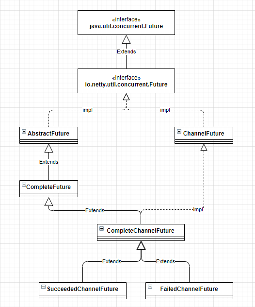
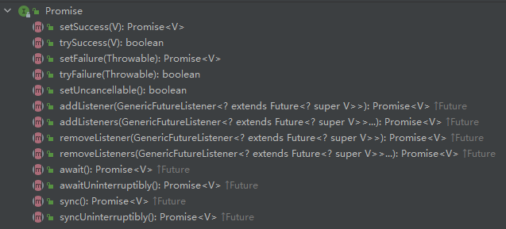
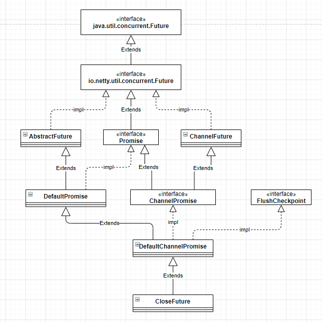

# Future

```java
package io.netty.util.concurrent;

public interface Future<V> extends java.util.concurrent.Future<V> {
	//...
}
```

Netty中的Future继承至`java.util.concurrent.Future`，用于**获取异步操作的结果**。

`java.util.concurrent.Future`接口中定义的方法如下：

| 返回类型 |               方法名称                |                           方法说明                           |
| :------: | :-----------------------------------: | :----------------------------------------------------------: |
| boolean  | cancel(boolean mayInterruptIfRunning) |                      尝试取消执行此任务                      |
|    V     |                 get()                 |                 等待计算完成，然后检索其结果                 |
|    V     |   get(long timeout, TimeUnit unit)    | 如果需要等待最多在给定的时间计算完成，然后检索其结果（如果可用） |
| boolean  |             isCancelled()             |         如果此任务在正常完成之前被取消，则返回`true`         |
| boolean  |               isDone()                |                   返回`true`如果任务已完成                   |

## Future实现类

Future实现类关系图如下



Netty通过继承`java.util.concurrent.Future`接口，扩展了一个`io.netty.util.concurrent.Future`接口。

### AbstractFuture

```java
public abstract class AbstractFuture<V> implements Future<V> {

    @Override
    public V get() throws InterruptedException, ExecutionException {
        await();

        Throwable cause = cause();
        if (cause == null) {
            return getNow();
        }
        if (cause instanceof CancellationException) {
            throw (CancellationException) cause;
        }
        throw new ExecutionException(cause);
    }

    @Override
    public V get(long timeout, TimeUnit unit) throws InterruptedException, ExecutionException, TimeoutException {
        if (await(timeout, unit)) {
            Throwable cause = cause();
            if (cause == null) {
                return getNow();
            }
            if (cause instanceof CancellationException) {
                throw (CancellationException) cause;
            }
            throw new ExecutionException(cause);
        }
        throw new TimeoutException();
    }
}
```

AbstractFuture实现比较简单，只是实现了两个get()方法。通过调用`await()`方法进行现场阻塞，当IO操作完成后通过`notify()`方法唤醒阻塞线程，程序继续执行获取结果。如果发生异常，抛出Exception。

### ChannelFuture

Netty中的Future都是与异步IO操作相关的，`ChannelFuture`表示与Channel操作相关。Netty中都是异步操作，IO调用都会立即返回，不会像传统BIO同步等待操作完成，因此，如果获取异步结果是我们需要关注的一个问题，`ChannelFuture`就是为了解决这个问题设计的。

`ChannelFuture`有两种状态：`Uncompleted`和`Completed`，

> - Uncompleted：非失败、非成功、非取消
> - completed：IO操作完成，结果可能是 `操作成功、操作失败、操作被取消`。

`ChannelFuture`的状态迁移图如下：

```java
                                      +---------------------------+
                                      | Completed successfully    |
                                      +---------------------------+
                                 +---->      isDone() = true      |
 +--------------------------+    |    |   isSuccess() = true      |
 |        Uncompleted       |    |    +===========================+
 +--------------------------+    |    | Completed with failure    |
 |      isDone() = false    |    |    +---------------------------+
 |   isSuccess() = false    |----+---->      isDone() = true      |
 | isCancelled() = false    |    |    |       cause() = non-null  |
 |       cause() = null     |    |    +===========================+
 +--------------------------+    |    | Completed by cancellation |
                                 |    +---------------------------+
                                 +---->      isDone() = true      |
                                      | isCancelled() = true      |
                                      +---------------------------+
```

#### Listener

`ChannelFuture`提供了添加、移除监听器的相关方法

```java
public interface ChannelFuture extends Future<Void> {
    @Override
    ChannelFuture addListener(GenericFutureListener<? extends Future<? super Void>> listener);

    @Override
    ChannelFuture addListeners(GenericFutureListener<? extends Future<? super Void>>... listeners);

    @Override
    ChannelFuture removeListener(GenericFutureListener<? extends Future<? super Void>> listener);

    @Override
    ChannelFuture removeListeners(GenericFutureListener<? extends Future<? super Void>>... listeners);
}
```

当IO操作完成之后，`ChannelFuture`会调用监听器的`operationComplete()`方法。

```java
public interface GenericFutureListener<F extends Future<?>> extends EventListener {

    /**
     * Invoked when the operation associated with the {@link Future} has been completed.
     *
     * @param future  the source {@link Future} which called this callback
     */
    void operationComplete(F future) throws Exception;
}
```

``operationComplete()`方法会将`ChannelFuture`当做入参传递到监听器中。如果在监听器中需要做上下文相关操作的话，需要将上下文信息保存在`ChannelFuture`中。

建议通过添加监听器的方式获取IO结果，如果我们使用`get()`方法获取结果，如果不设置超时时间，会导致线程长时间被阻塞甚至挂死。如果设置了超时时间，时间又无法精确预测。采用通知回调的机制，可以使性能达到最优。

> 注意：**不要在`ChannelHandler`中调用`await()`方法，会导致死锁**。原因是发起IO操作后，IO线程负责异步通知发起IO操作的线程，如果IO线程和用户线程是同一个，就会导致IO线程等待自己唤醒自己，就会造成自锁。

# Promise

`Promise`扩展至`Future`，提供了写操作相关接口。通过`Promise`对`Future`进行扩展，用于设置IO操作的结果。

```java
public interface Promise<V> extends Future<V> {
    //......
}
```



## Promise实现



### DefaultPromise

```java
public class DefaultPromise<V> extends AbstractFuture<V> implements Promise<V> {
    
    private static final AtomicReferenceFieldUpdater<DefaultPromise, Object> RESULT_UPDATER =
            AtomicReferenceFieldUpdater.newUpdater(DefaultPromise.class, Object.class, "result");
    
    @Override
    public Promise<V> setFailure(Throwable cause) {
        if (setFailure0(cause)) {
            notifyListeners();
            return this;
        }
        throw new IllegalStateException("complete already: " + this, cause);
    }
    

    private boolean setFailure0(Throwable cause) {
        return setValue0(new CauseHolder(checkNotNull(cause, "cause")));
    }
    
    private boolean setValue0(Object objResult) {
        if (RESULT_UPDATER.compareAndSet(this, null, objResult) ||
            RESULT_UPDATER.compareAndSet(this, UNCANCELLABLE, objResult)) {
            checkNotifyWaiters();
            return true;
        }
        return false;
    }
}
```

Netty通过`AtomicReferenceFieldUpdater`保证更新结果的线程安全。当更新完成之后，使用`notifyAll`唤醒等待的线程，然后进行监听器`GenericFutureListener`的回调。