# AOP入口类注册

研究AOP是如何实现动态代理的。

Spring通过 `@EnableAspectJAutoProxy` 注解开启AOP支持。

通过`@Import`注解导入`AspectJAutoProxyRegistrar.class`

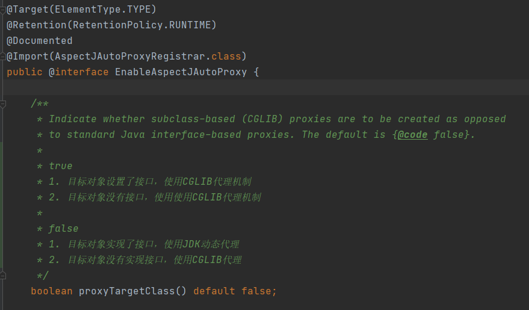

在`AspectJAutoProxyRegistrar`类中进行AOP入口类的注册并设置对应属性。

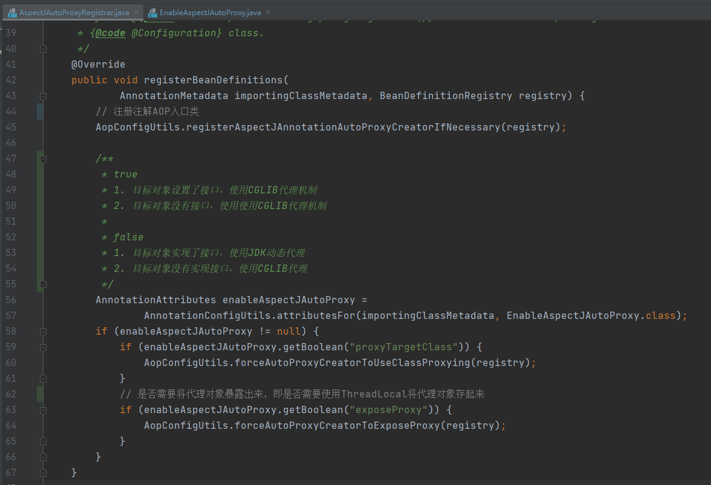

`AopConfigUtils.registerAspectJAnnotationAutoProxyCreatorIfNecessary()`方法中注册`AnnotationAwareAspectJAutoProxyCreator.class`

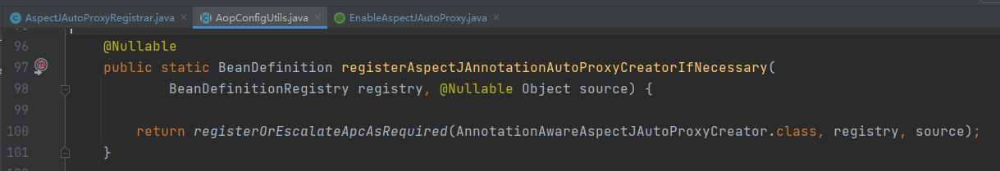

`AnnotationAwareAspectJAutoProxyCreator`AOP入口类中优先级是最高的。

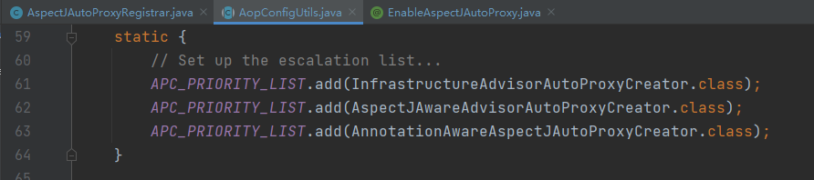

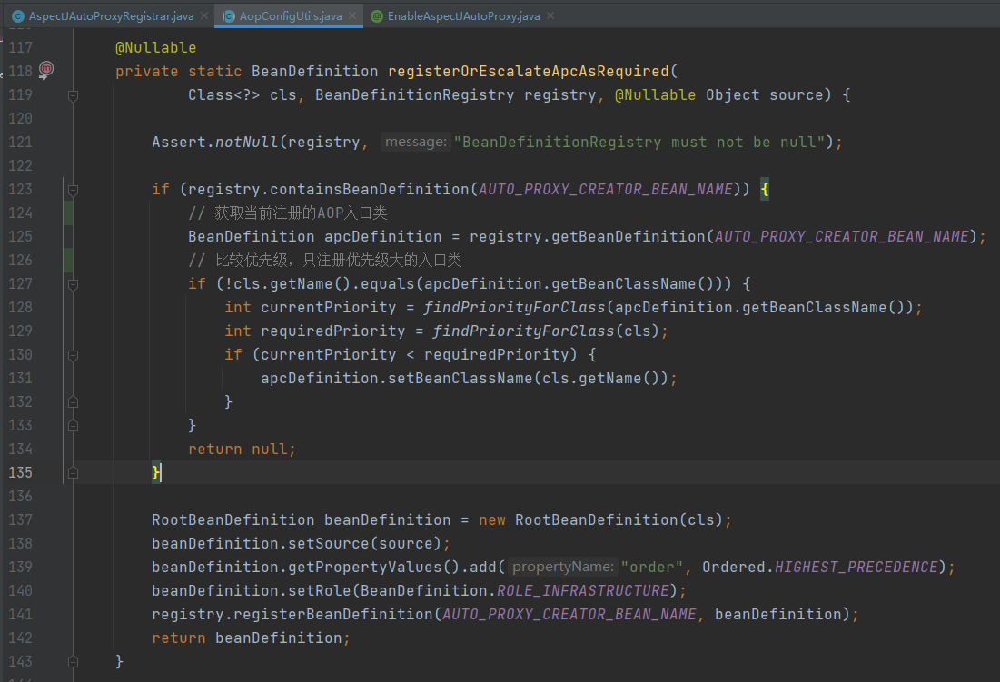

到这里AOP的入口类就注册完成了。

回到`AspectJAutoProxyRegistrar`这个类中，什么时候调用到`registerBeanDefinitions()`方法的呢？

在`ConfigurationClassPostProcessor`中对AOP `@Import`注解进行解析，`ConfigurationClassPostProcessor`是一个`BeanFactoryPostProcessor`，而`BeanFactoryPostProcessor`在bean收集完成之后进行实例化调用。

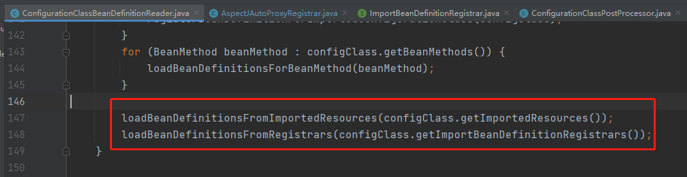

所以AOP入口类实际是在`BeanPostProcessor`接口调用时注册的。

# 代理对象生成

AOP启用时注册了`AspectJAutoProxyRegistrar`这个入口类，所以AOP代理对象的生成就是在这个类中生成的。

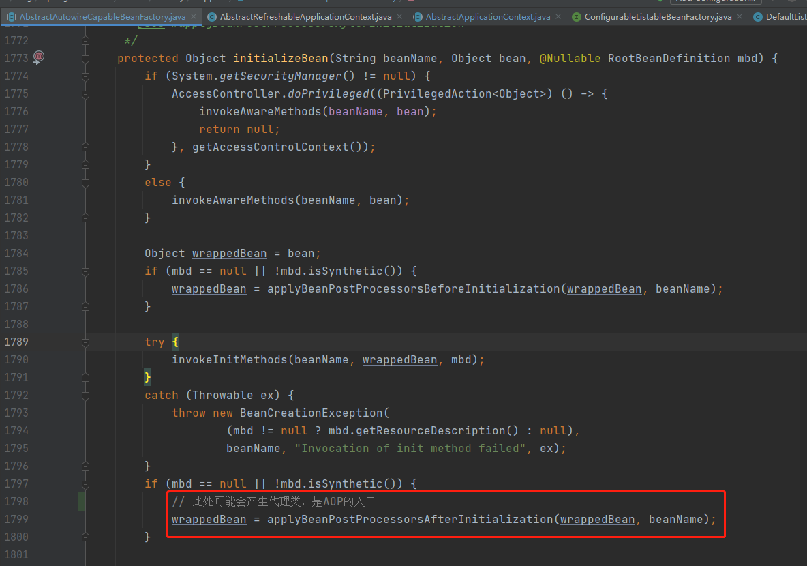

在Bean实例化完成后，会调用之前已经实例化的`BeanPostProcessor.postProcessAfterInitialization()`方法。这里就会调用到`AspectJAutoProxyRegistrar`类的相关方法。

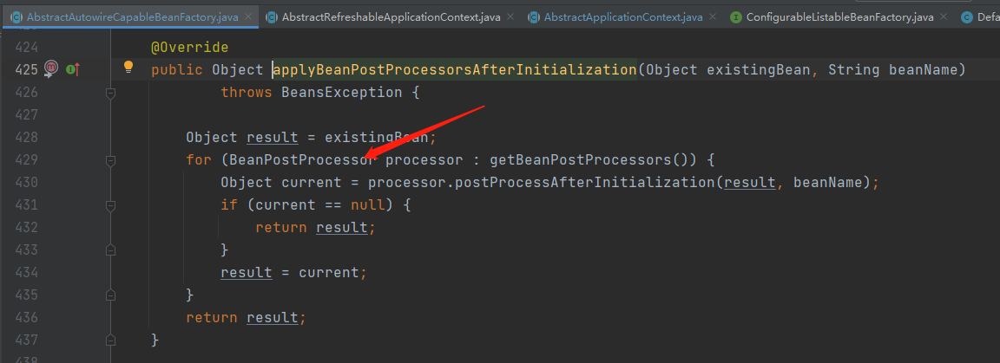

`wrapIfNecessary()`方法生成代理类。

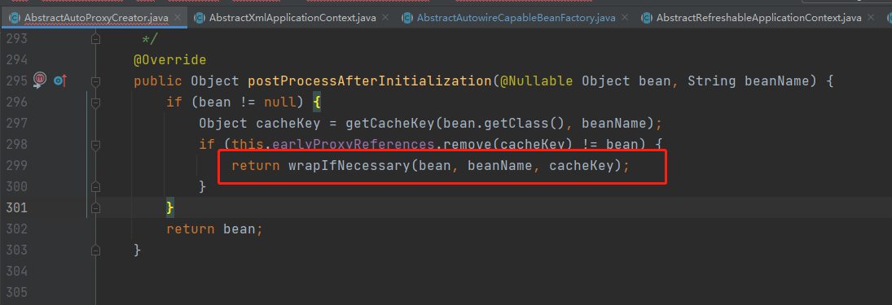

发现有作用在该Bean上的Advisor，就会创建一个Proxy。

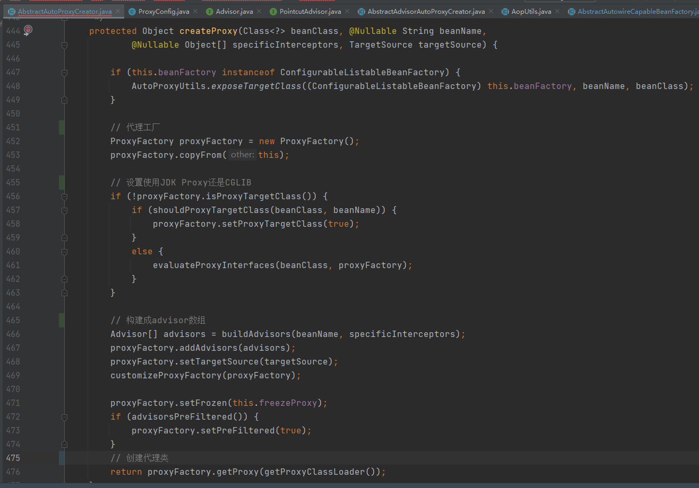

返回后，动态代理类就生成了。

# AOP Proxy对象执行

动态代理类生成了之后，实际是如何执行的呢？

以JDK动态代理类为例，在调用代理对象时，会调用`JdkDynamicAopProxy.invoke()`方法，

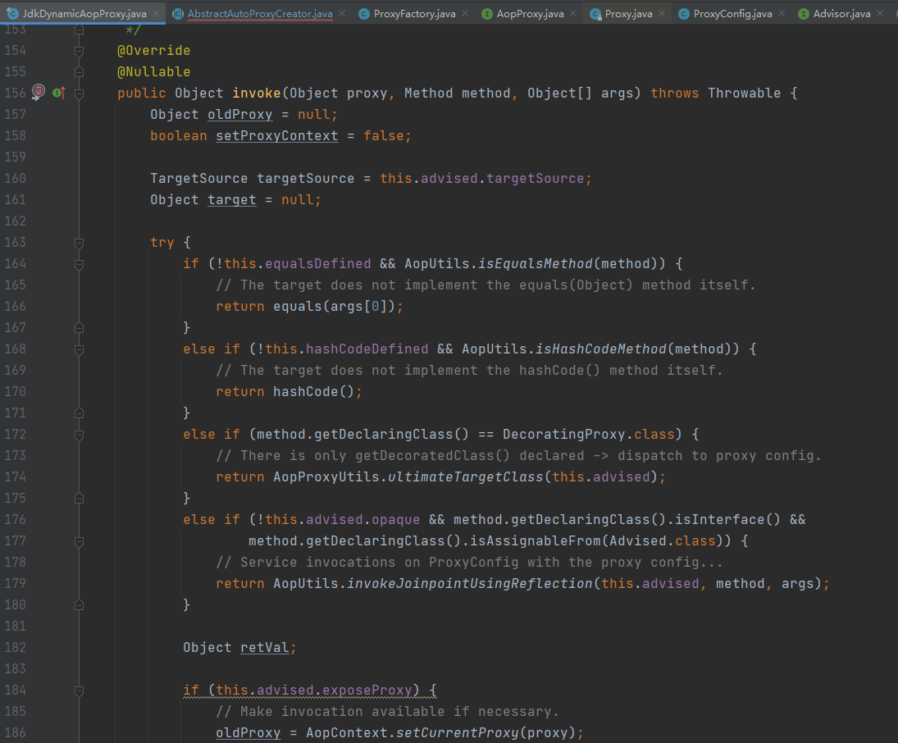

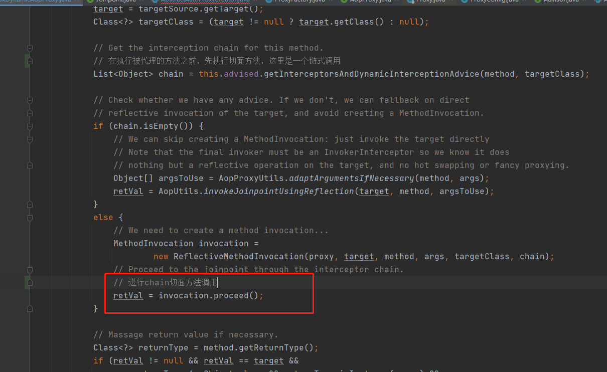