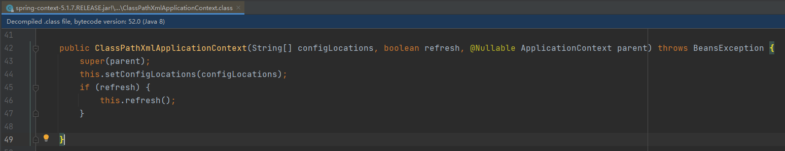

application.xml

```xml
<?xml version="1.0" encoding="UTF-8"?>
<beans xmlns="http://www.springframework.org/schema/beans"
       xmlns:xsi="http://www.w3.org/2001/XMLSchema-instance"
       xmlns:context="http://www.springframework.org/schema/context" xmlns:tx="http://www.springframework.org/schema/tx"
       xsi:schemaLocation="http://www.springframework.org/schema/beans http://www.springframework.org/schema/beans/spring-beans.xsd http://www.springframework.org/schema/context http://www.springframework.org/schema/context/spring-context.xsd http://www.springframework.org/schema/tx http://www.springframework.org/schema/tx/spring-tx.xsd">

    <context:component-scan base-package="springdemo" />
</beans>
```

以XML方式启动的启动类如下：

```java
public class SpringXmlApplication {
    public static void main(String[] args) {
        ClassPathXmlApplicationContext application = new ClassPathXmlApplicationContext("application.xml");
        UserBean bean = application.getBean(UserBean.class);
        bean.say();
    }
}
```

在初始化`ClassPathXmlApplicationContext`容器过程中，调用`refresh()`方法进行容器的初始化：



