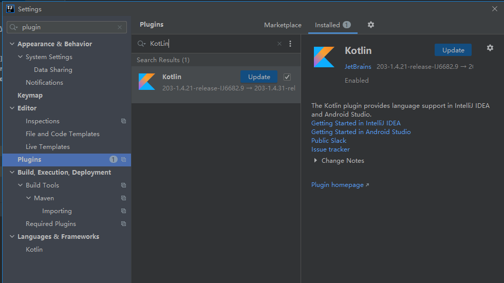

# 安装步骤

Spring源码下载以及编译流程记录

## 下载源码

```SHELL
git clone --branch v5.2.8.RELEASE https://github.com/spring-projects/spring-framework.git
```

> GitHub下载速度慢的话，可以先迁移到Gitee，然后再从Gitee下载
>
> git clone --branch v5.2.8.RELEASE https://gitee.com/Z201/spring-framework.git

## 修改`setting.gradle`文件

在`setting.gradle`文件中增加阿里云仓库

```groovy
repositories {
    gradlePluginPortal()
		
    maven { url 'https://maven.aliyun.com/repository/public' }
    
	maven { url 'https://repo.spring.io/plugins-release' }
}
```

## 修改 `gradle.properties`文件

`gradle.properties`文件修改如下

```
version=5.2.8.RELEASE
org.gradle.jvmargs=-Xmx2048M
org.gradle.caching=true
org.gradle.parallel=true
org.gradle.configureondemand=true
org.gradle.daemon=true
```

## 修改`build.gradle`文件

增加阿里云仓库

```json
repositories {
	maven { url 'https://maven.aliyun.com/nexus/content/groups/public/' }
	maven { url 'https://maven.aliyun.com/nexus/content/repositories/jcenter'}
}
```

## 编译`spring-oxm`模块

在工程主目录下使用如下命令编译：

```shell
.\gradlew :spring-oxm:compileTestJava
```

> 下载依赖时出现异常：
>
> Could not HEAD 'https://repo.spring.io/plugins-release/io/spring/gradle-enterprise-conventions/io.spring.gradle-enterprise-conventions.gradle.plugin/0.0.2/io.spring.gradle-enterprise-conventions.gradle.plugin-0.0.2.jar'. Received status code 401 from server: Unauthorized
>
> 

## IDEA导入Spring源码

## Idea安装`Kotlin`插件



## 安装并配置`Gradle`

# 问题记录

## Received status code 401 from server: Unauthorized

详细日志如下：

```shell
Error resolving plugin [id: 'io.spring.gradle-enterprise-conventions', version: '0.0.2']
> Could not resolve all dependencies for configuration 'detachedConfiguration5'.
   > Could not determine artifacts for io.spring.gradle-enterprise-conventions:io.spring.gradle-enterprise-conventions.gradle.plugin:0.0.2
      > Could not get resource 'https://repo.spring.io/plugins-release/io/spring/gradle-enterprise-conventions/io.spring.gradle-enterprise-conventions.gradle.plugin/0.0.2/io.spring.gradle-enterprise-conventions.gradle.plugin-0.0.2.jar'.
         > Could not HEAD 'https://repo.spring.io/plugins-release/io/spring/gradle-enterprise-conventions/io.spring.gradle-enterprise-conventions.gradle.plugin/0.0.2/io.spring.gradle-enterprise-conventions.gradle.plugin-0.0.2.jar'. Received status code 401 from server: Unauthorized
```

从spring中下载`io.spring.gradle-enterprise-conventions.gradle.plugin-0.0.2.jar`文件时出现`401`错误，从阿里仓库中只能查找到`0.0.4`版本的包。

**解决方法**

由于从`repo.spring.io`下载依赖包需要登录，并且阿里云的仓库中也无法找到`io.spring.gradle-enterprise-conventions.gradle.plugin-0.0.2.jar`这个包，所以在`build.gradle`中修改为`0.0.4`版本即可。