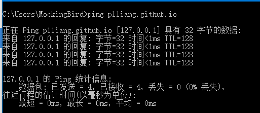
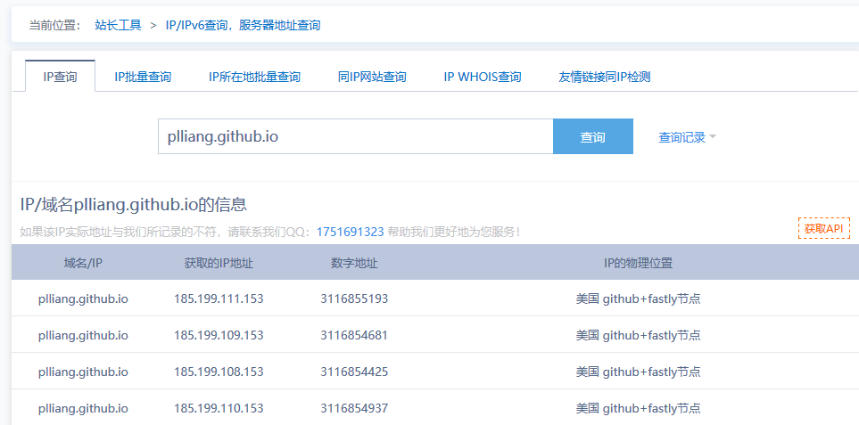
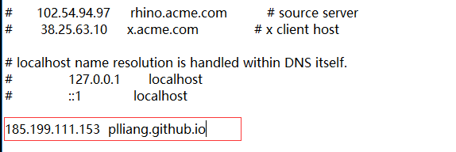
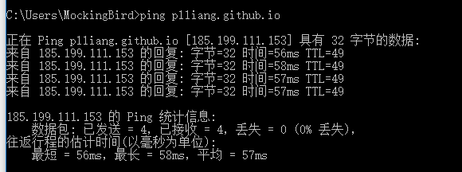

**描述：** 无法访问GitHub Pages，使用ping命令，得到的地址为`127.0.0.1`

**原因：**

1. 可能是本地hosts配置了对应域名的地址
2. DNS污染，导致无法解析github.io

**解决方案：**

1. 查看`hosts`文件,是否有将对应的 `github.io` 地址配置为 `127.0.0.1`
2. 修改DNS为 `114.114.114.114` 或 `8.8.8.8`

如果尝试上述两种方法后仍然不能访问，那么可能就是DNS被污染了，使用下面的方法解决：

1. 访问IP查询网站：[站长之家 IP查询](https://ip.tool.chinaz.com/)
2. 输入需要查询的IP，获取地址

3. 将查询到的地址加入到hosts文件中

4. 保存后即可正常访问

